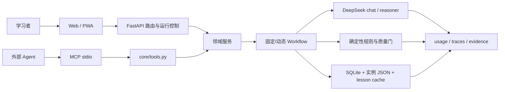
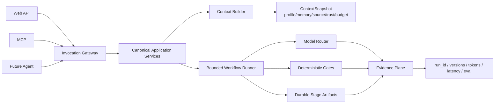

# LearnBuddy Harness 系统审计与演进建议

> 更新时间：2026-07-12
>
> 当前基线：线上 V0.52；本地 V0.53 已完成工程回归，尚未完成人工复核、生产备份、部署与线上回归。
>
> 本文定位：对当前实现做事实盘点、优缺点分析和后续规划。需求与发布状态仍以 `SPEC.md` ADR-055 和 `docs/LearnBuddy项目工作台.html` 为准。
>
> 可视化阅读：[`Harness技术体系对齐.html`](./Harness技术体系对齐.html)

---

## 0. 执行结论

LearnBuddy 已经不是“模型 + Prompt 的 Demo”。Web 主链路已经形成一套可用的 Harness：有持久对象、确定性规则、受控 LLM workflow、质量门、失败回退、后台任务、账号隔离、反馈、用量记录和测试回归。

当前真正的问题不是“Agent 不够多”，而是以下三类工程尚未统一：

1. **运行证据没有串成一条链**：`usage`、`llm_traces`、`background_jobs`、`ScoreEvidence` 和 lesson 质量记录分别存在，但缺少统一 `run_id`，无法完整回答“一次产出用了什么画像、上下文、模型、Prompt、工具和返工轮次”。
2. **同一能力在不同入口的语义不完全一致**：Web 课程生成具备额度、限流、后台任务、缓存升级、学习时长合同、学员信号和最终质量拒绝；MCP `generate_lesson` 直接调用核心函数，没有获得同等运行合同。
3. **V0.53 画像尚未真正进入单节教学运行时**：路径生成会消费六维能力画像并写入 `baseline_decisions`，但 lesson 生成主要读取 `baseline_summary + mastery + memory`，没有显式读取 `baseline_profile` 的维度分、证据版本和针对性教学动作。

因此，建议的主线是：

- **现在**：不扩需求，先完成 V0.53 发布硬门。
- **V0.54**：把“真实能力画像 → 课程上下文快照 → 深度教学 → 质量证据 → 学习结果”接成可追溯闭环。
- **V0.54 之后**：先统一 Web/MCP 的应用服务、权限和审计，再考虑 OpenClaw 或真 Agent；不提前建设自由多 Agent、Agent Team、A2A 或通用 ReAct 框架。

---

## 1. 审计范围与证据

### 1.1 本次检查范围

| 域 | 主要实现 |
|---|---|
| 模型调用 | `core/llm_client.py`、`core/prompts/` |
| 对话与上下文 | `core/engine.py`、`core/conversations.py` |
| 真实能力诊断 | `core/evaluator.py`、`core/baseline.py`、`core/assessment_scoring.py` |
| 路径与课程生成 | `core/generator.py`、`core/path_deepbuild.py`、`core/content.py`、`core/content_quality.py` |
| 学习闭环 | `core/learning.py`、`core/recommend.py`、`core/replan.py`、`core/self_check.py` |
| Memory / RAG | `core/memory.py`、`core/rag.py`、`core/source_search.py` |
| 工具与外部入口 | `core/tools.py`、`mcp_server.py`、`server.py` |
| 运行可靠性 | `core/jobs.py`、`core/auth.py`、`core/rate_limit.py`、`core/account_data.py` |
| Eval 与观测 | `core/usage.py`、`core/tracing.py`、`core/feedback.py`、`tests/`、`scripts/` |

### 1.2 当前验证证据

- 2026-07-16 本地全量测试：`398 passed`，4 条 FastAPI `on_event` 弃用警告，无失败。
- V0.53 已存在 30 条跨领域离线 Eval Case、18 条真实 DeepSeek 开放题冻结评分和双人人工评分表。
- 本次没有重新执行真实 DeepSeek 内容生成、LearnBuddy 核心业务浏览器回归和生产环境验证；这些仍沿用 ADR-055 已记录证据，并明确属于 V0.53 发布剩余工作。
- 本次仅对更新后的 Harness 文档页重新做桌面与 390px 浏览器检查。

---

## 2. 当前系统结构

当前分层判断是正确的：

- **确定性层**：鉴权、限流、DAG、掌握度、调度、质量结构门、状态守卫。
- **固定 Workflow**：路径研究与大纲、课程设计/写作/Critic/返工、基线出题与评分。
- **动态 Workflow**：每日推荐、卡壳/超额/中断重规划、低置信追加验证题。
- **真 Agent**：尚未进入大众产品主链，符合“能用规则和 Workflow 就不用自由 Agent”的 ADR-011。

### 2.1 关键对象与真相源

| 对象 | Canonical ID | 当前真相源 | 主要消费者 | 判断 |
|---|---|---|---|---|
| 对话会话 | `user_id + session_id` | SQLite `conversation_sessions/messages` | onboarding、恢复、运营分析 | 清晰 |
| 能力诊断 | `assessment_id` | SQLite baseline 系列表 | 结果页、路径生成、异议 | 清晰，V0.53 核心优点 |
| 评分证据 | `evidence_id` | SQLite `baseline_score_evidence` | AbilityProfile、路径决策 | 清晰且可追溯 |
| 学习路径 | `instance_id` | `meta.json/master.json/Wn.json` + `_index.json` | 空间页、路径页、课程生成 | 可用，但属于混合存储 |
| 单节课程 | `instance_id + topic + cache_version` | lesson cache JSON | 学习页、lesson runtime | 缺独立 `lesson_run_id` |
| 学练事实 | `user_id + instance_id + topic` | SQLite answers/completions/artifacts | 掌握度、推荐、重规划、Memory | 清晰 |
| 重规划提案 | `proposal_id` | SQLite proposal + `master.json` 应用结果 | 今日页、路径 | 有确认、拒绝、撤销 |
| Memory | `memory_id` | SQLite `user_memory` | 教练、课程个性化 | 有作用域，来源治理不足 |
| 后台任务 | `job_id` | SQLite `background_jobs` + 进程内 task | 路径/课程状态页 | 可恢复查询，不支持断点续跑 |
| LLM 运行记录 | 各表自增 ID | `usage` 与 `llm_traces` 分离 | 管理后台 | 缺统一关联 ID |

---

## 3. 七个域的系统评估

| 域 | 当前成熟度 | 做得好的地方 | 主要缺口 | 建议 |
|---|---|---|---|---|
| 模型与 Prompt | 🟡 可用 | chat/reasoner 路由、结构化解析、超时和 fallback 已有 | 内容 Prompt 缺统一版本；重试/熔断策略不显式；稳定规则放在动态输入之后，不利于前缀缓存 | 先补版本与运行证据，再谈缓存优化 |
| Context Engineering | 🟡 部分闭环 | 会话最多恢复 60 条；RAG、学习者信号和学习时长合同按场景注入 | 无 token/字符预算合同、裁剪记录、信任分区和长会话压缩；原始外部内容直接进入课程 Prompt | 建立 `ContextSnapshot` 与 trust zone |
| Memory | 🟡 基础可靠 | 全局/空间作用域；用户/派生来源；确定性派生；旧弱项会清理；用户可删除 | 缺来源证据 ID、置信度、有效期、冲突替换和暂停；手写内容会直接影响 Prompt | 补治理，不增加 Procedural Memory |
| Tool / MCP | 🟡 地基可用 | 13 个工具、显式 `user_id`、访问守卫、`mutates` 标记、stdio MCP | 参数只校验必填；无风险级别/审批/幂等/审计；MCP 不经过 Web 的额度、限流、任务、缓存与质量合同 | 外部 Agent 开放前统一应用服务和调用网关 |
| Workflow / Loop | 🟢 主链较强 | 课程 bounded quality loop、路径质量修复、推荐、重规划、阶段闸门、SM-2、失败重试 | stage 只记录进度，进程重启后仍从头重试；系统改进 Loop 缺版本对比 | V0.54 增加可恢复阶段产物和明确预算 |
| Eval / Observability | 🟡 能看见但未串联 | 398 tests、golden 解析、内容质量门、V0.53 Eval、人类发布门、反馈和匿名聚合 | Trace 覆盖不完整；usage/trace/evidence/job 不能关联；内容 Eval 仍偏结构，跨领域人工基准不足 | 建立 `run_id + eval_run + version comparison` |
| 安全与运行时 | 🟡 Web 较强、Agent 较弱 | Secure Cookie、限流、账号隔离、导出删除、前端 Markdown allowlist、诊断不可信输入声明 | 通用课程/RAG Prompt 缺 indirect injection 隔离；MCP 写工具无审批；混合文件/SQLite 无统一事务 | Web 保持现状；Agent 通道单独设发布门 |

---

## 4. 做得好的地方

### 4.1 技术分层克制

LearnBuddy 没有把所有能力包装成 Agent。推荐、阶段闸门、SM-2、掌握度和重规划检测尽量使用确定性代码；只有出题、开放题评分、路径大纲、课程写作和语义 Critic 使用 LLM。这让成本、回归和错误边界都更可控。

### 4.2 V0.53 是目前最完整的 Harness 样板

V0.53 已经具备：版本化 Blueprint、不可变题目快照、逐题持久化、双阶段状态机、确定性客观题评分、Rubric evaluator、低置信追加题、ScoreEvidence、AbilityProfile、路径 evidence_id、异议和人工发布门。它不是“让模型自评自己”，而是把业务正确性放进多层验证。

### 4.3 内容生成不是单次 Prompt

当前课程生成已经是：

`来源检索 → 课设 → 长课分段写作/普通写作 → 确定性质量门 → 扩写 → Critic → bounded revise → 保留 best → 原子缓存`

这比继续堆 System Prompt 更可靠，也已经具备超时转后台、旧缓存升级、失败不覆盖好缓存等生产型行为。

### 4.4 用户学习 Loop 基本闭合

答题和产出会进入掌握度、Memory、SM-2、每日推荐和重规划；周计划还受自检与阶段闸门约束。重规划不是自动改用户路径，而是先产生 proposal，再由用户确认、拒绝或撤销。

### 4.5 工程验证纪律较强

当前 398 个测试覆盖结构解析、路径生成、内容质量、V0.53 评分、Release Loop、账号隔离、限流、后台任务恢复、双端静态合同和负例。这是 LearnBuddy 能继续使用 AI Coding Agent 迭代的重要资产。

---

## 5. 问题与优先级

### P0：当前发布阻塞

| ID | 问题 | 影响 | 建议与退出门 |
|---|---|---|---|
| P0-01 | V0.53 仍缺双人人工评分、生产备份、部署和线上回归 | 本地工程通过不能代表诊断可信度和生产完成 | 不插入 V0.54 开发；人工档位一致率 ≥80%、MAE ≤10，完成备份和线上全链路后再发布 |

### P1：下一阶段高杠杆问题

| ID | 问题 | 具体证据 | 影响 | 建议 |
|---|---|---|---|---|
| P1-01 | 六维画像未进入 lesson 运行时 | `master.north_star.baseline_profile` 已保存，但 `_instance_lesson_context()` 只取 `baseline_summary`；`_lesson_learner_signals()` 只取 mastery + memory | V0.53 修好的诊断不能精确控制单节难度、练习和验收方式 | V0.54 新增 `LessonContextSnapshot`，按 profile version 选择能力维度和 evidence 摘要 |
| P1-02 | Web 与 MCP 能力语义漂移 | Web lesson 有 quota/rate limit/job/cache/session contract/learner signals/final gate；工具入口没有 | 外部 Agent 可能得到不同质量、绕过计量和运行守卫 | 提取 canonical application service；Web/MCP 只做 adapter |
| P1-03 | 运行证据碎片化 | `usage`、`llm_traces`、job、ScoreEvidence、lesson `_quality_loop` 无共同 ID | 失败难回放，Prompt 改动难做真实前后比较 | 全链路增加 `run_id`，stage/LLM/tool/eval 共同引用 |
| P1-04 | Context 缺信任与预算合同 | lesson Prompt 把 `context/learner_signals/custom_instruction` 当普通输入；只有 assessment scorer 明确声明不可信 | RAG/用户资料可能夹带指令；长会话和长来源可能产生 context rot | 分 `system policy / trusted state / untrusted evidence / user request` 四区，记录大小、裁剪和来源 |
| P1-05 | 内容 Eval 仍偏结构正确 | 本地门能检查卡片、字数、活动和引用；线上 golden 主要是一条 Agent memory 样本 | “结构完整”不等于“真能学会”，同一模型写作与 Critic 可能共享误解 | V0.54 先建跨领域、画像配对的人工 Eval，再改生成链 |
| P1-06 | 长内容任务不可断点续跑 | job 持久化 stage，但服务重启会把 running 转成可重试 error | 180 秒级生成可能重复花费时间和 token | 持久化已验证 stage artifact；仅从最后安全 checkpoint 续跑 |
| P1-07 | Harness 文档和待办已漂移 | 旧文档仍把 reasoner、MCP、LLM-as-Judge、Eval/Golden 写成缺失，并把多 Agent 当默认下一步 | 后续 AI Agent 容易重复开发或走错优先级 | 本文替换旧清单；以后只按问题证据增加 Harness 任务 |

### P2：重要但不应抢占 V0.54 主线

| ID | 问题 | 建议 |
|---|---|---|
| P2-01 | Memory 缺 provenance/confidence/expiry/conflict | 给派生记忆保存事实来源与生成规则版本；支持纠正、暂停和过期，不把做事流程存进长期 Memory |
| P2-02 | Tool schema 和错误返回过薄 | 校验类型与 `additionalProperties=false`；返回 `code/retryable/suggested_action/details` |
| P2-03 | Prompt 前缀不利于缓存 | 把稳定角色、规则和输出 schema 放前面，动态输入放后面；先观测 cache token 再优化 |
| P2-04 | SQLite + JSON 混合存储增加备份/事务复杂度 | V0 阶段继续保留，但建立一致性扫描与双介质备份；不要为了整洁贸然全迁数据库 |
| P2-05 | LLM 容灾策略不统一 | 在真实失败率和成本数据出现后，再增加显式 retry/circuit breaker/provider routing |
| P2-06 | FastAPI 生命周期 API 已弃用 | 后续维护窗口迁移到 lifespan，不作为产品版本 |

---

## 6. 关键流程闭环判断

> 这是基于当前代码、测试和既有回归记录的结构判断；本次没有重新执行核心业务浏览器流程。

| 流程 | Object effect | Persist | Same ID | Re-entry | Guard | Error/cancel | 结论 |
|---|---:|---:|---:|---:|---:|---:|---|
| V0.53 诊断 → evidence → profile → path | ✓ | ✓ | ✓ | ✓ | ✓ | ✓ | 本地 6/6；发布门仍未完成 |
| Web lesson 生成 → 缓存 → 学习页 | ✓ | ✓ | △ | ✓ | ✓ | ✓ | 5/6；缺稳定 `lesson_run_id`，但用户恢复路径完整 |
| 重规划 proposal → confirm/reject/undo | ✓ | ✓ | ✓ | ✓ | ✓ | ✓ | 6/6 |
| MCP lesson 生成 | ✓ | ✗ | ✗ | ✗ | △ | △ | 2.5/6；只能视为开发者预览入口，不能宣称与 Web 等价 |
| 反馈 → Prompt 版本比较 → 发布决策 | ✓ | ✓ | ✗ | △ | ✗ | ✓ | 3/6；有反馈和聚合，没有版本化实验闭环 |

---

## 7. 目标架构

### 7.1 核心合同

| 合同 | 必要字段 | 解决的问题 |
|---|---|---|
| `InvocationContext` | `user_id/channel/request_id/run_id/permission_policy/quota_policy` | Web、MCP 和未来 Agent 共用同一守卫 |
| `LessonContextSnapshot` | `profile_id/version/selected_abilities/evidence_ids/memory_ids/source_ids/trust_zone/size/truncation` | 证明课程为什么这样教，并可重放 |
| `LessonRun` | `run_id/instance_id/topic/cache_version/status/stage/budget/stop_reason` | 给单节生成稳定身份和恢复能力 |
| `ToolResult` | `ok/code/retryable/suggested_action/data/audit_id` | 让 Agent 能纠错而不是猜错误字符串 |
| `EvaluationRun` | `eval_set_version/candidate_version/baseline_version/metrics/human_review` | 证明 Prompt/模型改动是否真实变好 |

### 7.2 所有权规则

- **领域服务拥有业务语义**：assessment、path、lesson、learning、replan、memory 各有唯一 canonical service。
- **Adapter 不重写业务流程**：FastAPI、MCP、未来 IM 只做鉴权、协议转换和呈现。
- **Context Builder 拥有注入规则**：各模块不再自行拼接一套隐式画像与来源。
- **Workflow Runner 拥有预算和停止条件**：每个 workflow 明确最大轮数、时间、token、fallback 和 checkpoint。
- **Evidence Plane 拥有运行事实**：业务对象保存结果；Evidence Plane 保存如何得到结果。

---

## 8. V0.53 → V0.54 建议路线

### Gate 0：先发布 V0.53

`scripts/release_loop.py` 已把本门收敛为不可绕过的顺序状态机；当前 `status` 准确停在 `human_review`：18 条样本完成 0 条，缺 36 个双人人工评分单元，尚未连接生产。

1. 两位评审独立填写 18 条开放题评分。
2. 运行一致率与 MAE 计算器；不达标则只修评分合同，不启动 V0.54。
3. 生产数据库与 `data/instances` 双备份。
4. 部署并完成桌面/390px、刷新恢复、失败重试、跨账号、旧画像兼容与异议流程。
5. 更新 `SPEC.md` 与项目工作台状态，不能提前写“V0.53 已上线”。

### V0.54-M1：先冻结深度教学 Eval 与数据合同

- 建立 `6 个领域 × 3 个画像差异 = 18` 条固定 Lesson Eval Case。
- 同一主题至少提供两组画像，验收系统是否真的改变：讲解深度、前置补强、练习类型、AI 验收任务和节奏。
- 冻结 `LessonContextSnapshot`、`LessonRun` 和 cache invalidation 规则。
- 明确非目标：不引入自由多 Agent，不重写所有页面，不迁移全部 JSON 到数据库。

### V0.54-M2：让课程真正消费 V0.53 画像

- `independent_foundation` 低：增加先修解释、无工具尝试和基础检验。
- `independent_transfer` 低：增加跨情境 worked example 与新材料迁移题。
- `ai_collaboration` 低：增加任务拆解、上下文补充和迭代修订练习。
- `verification_correction` 低：强制来源/反例/测试验收，不让“AI 给了答案”直接算完成。
- `self_calibration` 低：练习前记录信心，结果后展示偏差。
- 只向 Prompt 注入必要的维度摘要和 evidence 引用，不注入完整原始回答。

### V0.54-M3：补运行证据与可恢复性

- 一次 lesson 生成只产生一个 `run_id`，所有 LLM stage、质量门、返工轮次和缓存结果共同引用。
- 每个 stage 保存输入摘要、输出 artifact、模型/Prompt 版本、token、耗时和 stop reason。
- 外部来源、用户知识库、Memory 与本次要求分 trust zone；任何截断都留下原因和续读信息。
- 长课从最后通过验证的 checkpoint 续跑；失败不得覆盖当前好缓存。

### V0.54-M4：验证与发布

- 18 条固定 Lesson Eval 全量重跑，并与 V0.53/旧 lesson pipeline 做盲评比较。
- 确定性合同 100% 通过；人工判断“画像变化导致的教学变化”达到预设一致率后才发布。
- 至少验证桌面与 390px、缓存升级、刷新恢复、重启重试、低额度、来源失败和 Prompt injection 负例。
- 上线后观察：课程完成率、主动产出完成率、重生成率、负反馈率、单节 token/耗时、后测增益。

### V0.54 之后：外部 Agent readiness

只有明确要开放 OpenClaw/MCP 写操作时，才补：

1. Web/MCP canonical application service。
2. 工具风险等级、审批、幂等键、审计日志和结构化错误。
3. MCP 协议兼容测试与用户级额度/限流。
4. 按需工具发现；13 个工具阶段不需要复杂工具检索框架。

---

## 9. 旧 Harness 待办的处置

| 旧项 | 新判断 | 处置 |
|---|---|---|
| T-21 reasoner 路由 | 已通过 `get_reasoner_model()` 落地 | 标记完成 |
| T-22 批处理与缓存 | lesson cache 已有；批处理缺真实需求 | 改为先观测 cache/成本，不单独立项 |
| T-23 Prompt 版本化 + AB | 仍有价值，但依赖统一 run/eval | 保留并合入 Evidence Plane |
| T-24 Context 预算 | 仍是核心缺口 | 升级为 ContextSnapshot + trust zone |
| T-25 Procedural Memory | 方向不对；流程应进 Skill/代码，不应成为隐性长期记忆 | 替换为 Memory provenance/expiry/correction |
| T-26 通用 ReAct/Reflexion | 当前没有对应用户问题 | 删除默认排期，按真实 Agent 场景再建 |
| T-27/T-30 MCP 标准化 | MCP 已存在，但通道语义不等价 | 重写为 application service parity + contract tests |
| T-28 Skill 包化 | 仅在外部 Agent 产品化时需要 | 延后 |
| T-29 Guardrails + LLM Judge | 内容 Critic、V0.53 evaluator 已部分完成 | 继续补不可信上下文与注入负例 |
| T-31 RAG 检索评估 | 仍缺固定检索基准 | 保留，进入内容 Eval |
| T-32 注入防护 | 仍是高价值缺口 | 保留，但做 trust zone，不引入空泛 AgentGuard 名词层 |
| T-33/T-34 Agent Team/A2A | 没有当前学习者问题或可验证收益 | 移出主线 |
| T-35 通用 Dynamic Workflow 框架 | 当前具体状态机已足够 | 不建框架；只抽共同预算/checkpoint 合同 |
| T-36 Eval Harness | V0.53 已落地，内容侧仍不足 | 标记部分完成，扩到 V0.54 Lesson Eval |
| T-37 Token 经济策略 | 已有 usage/额度，缺版本关联与 cache 指标 | 先统一 run trace，再决定 routing/cache |

---

## 10. 明确不建议做的事

- 不因为 WorkBuddy 使用 Sub-agent，就给 LearnBuddy 增加自由多 Agent。
- 不把一次成功经验自动写成 Procedural Memory；稳定流程必须进入可版本化、可测试的 Skill 或确定性代码。
- 不为了“架构先进”引入 LangGraph、通用 Workflow DSL、OpenTelemetry 全家桶或向量数据库迁移。
- 不把更多规则继续堆进 Prompt；可计算的规则下沉到代码和质量门。
- 不用 Generator 自己写的测试证明全部业务正确；V0.53 的双人人工门应成为高风险 LLM 判断的范式。
- 不在 V0.53 发布前启动 V0.54 实现。

---

## 11. 完成门

### V0.53 发布完成门

- 双人人工档位一致率 ≥80%，MAE ≤10/100。
- 生产备份、部署、线上回归完成。
- P0 流程刷新/重试/跨账号达到 6/6。
- 项目工作台和 SPEC 明确写为“已上线”，而不是本地完成。

### V0.54 完成门

- 18 条多领域/多画像 Lesson Eval 可重复运行。
- 每节课能回指 `profile_version + evidence_ids + context_snapshot + run_id + prompt/model version`。
- 确定性质量门先于语义 Critic；bounded loop 有明确预算和 stop reason。
- 相同主题、不同画像能产生符合能力缺口的可解释差异，而不是只替换措辞。
- 来源失败、模型失败、服务重启、缓存过期和注入负例都有显式恢复路径。
- 全量测试、真实 DeepSeek 样本、桌面/390px 和控制台回归通过。

---

## 12. 残余风险

- 本次审计没有重新执行真实 LLM 和核心业务浏览器流程；不能替代 V0.53 发布验收。
- SQLite + JSON 混合存储在单机 V0 阶段可接受，但生产备份必须同时覆盖两者。
- 内容质量仍缺长期学习增益证据；V0.54 最多证明“教学内容更匹配且可执行”，真正学习增益需要后续学前—学后测量。
- MCP 当前应视为开发者预览地基，不应对外宣称与 Web 产品完全等价。

---

## 13. 维护规则

1. 只在出现重复失败、明确高风险或可量化收益时新增 Harness 机制。
2. 每项新机制必须写清：解决什么问题、作用于哪个对象、失败如何恢复、如何验证收益、有什么副作用。
3. 每次重大版本发布后刷新本文“现状 / 差距 / 行动”，删除已完成或失效任务。
4. 本文负责 Harness 专题判断；产品版本事实仍由 `SPEC.md` ADR 和 `LearnBuddy项目工作台.html` 负责。
