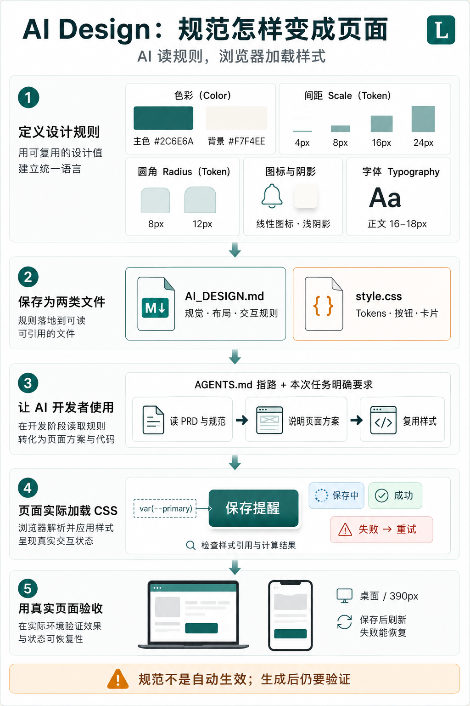
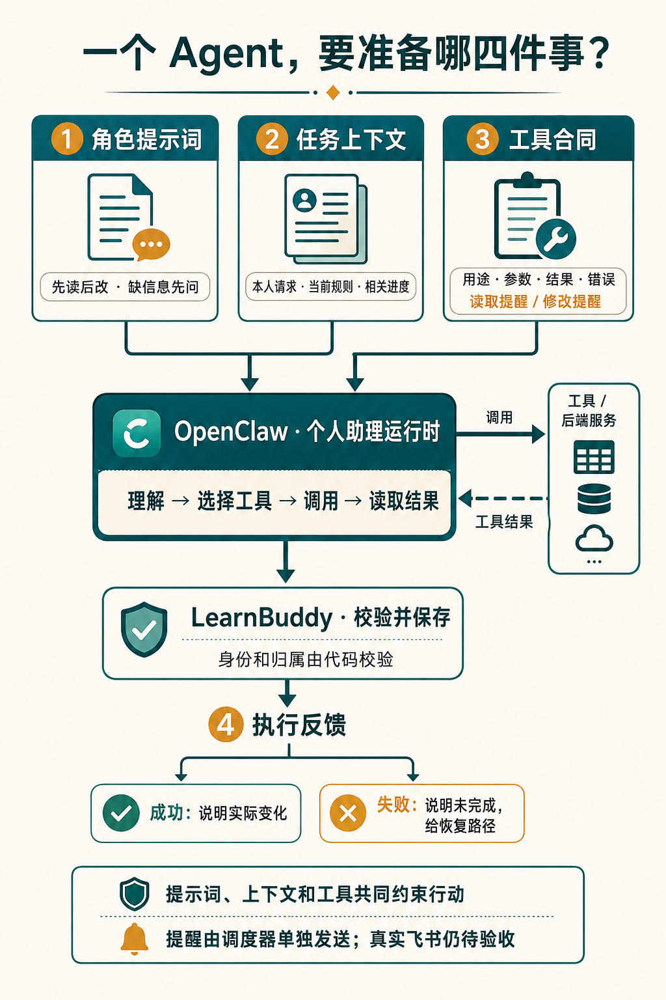

# 用 AI 从零构建学习助手：需求、设计、开发全流程实战

100 天 AI Builder · 第一周

想学日语、写作或编程，找资料并不难。难的是：从哪里开始？今天学什么？学过以后，下一步怎么安排？

**LearnBuddy 是围绕这些问题构建的开源 AI 学习伙伴。** 你告诉它学习目标、基础和可投入的时间，它通过对话与摸底生成学习路径，再把目标拆成每周、每天的任务。学习记录则为复习与调整提供依据。

网页承载完整的学习体验；个人部署后，还可以按接入方案配置 OpenClaw 和飞书，把学习助手接到日常聊天中。

这次，我把源码、需求、设计规范和开发过程一起公开。文章想分享的，不只是“做一个带 AI 的产品”，更是：**怎样借助 AI 分析需求、设计页面、编写代码，再检查它是否真正做对。**

你负责目标、取舍和验收，AI 协助分析、实现与排查。下面就用“每天晚上 9 点提醒我学习”这条小需求，把过程走一遍。

## 一、先说清楚：产品、助理和飞书各做什么？

这套产品里，有三个不同的角色。

**LearnBuddy 管学习。** 目标、计划、任务、进度和提醒规则保存在这里，网页通过它展示课程、练习和记录。

**OpenClaw 承载个人助理。** 它接收请求、组织上下文，让模型理解意图，再调用学习工具。例如先读取今日计划，再整理成回复。

**飞书是 IM，也就是即时通讯入口。** 它负责收发消息：你在这里提问、接收回复和提醒。它不是另一套学习系统，也不负责重新维护课表。


分开职责，才能避免“网页一份计划、机器人又记一份计划”。两种入口都应该使用 LearnBuddy 中的个人学习数据。

网页适合看完整计划、阅读课程和做练习；聊天适合随时问一句、记录反馈或调整提醒。它们互相补充，不是谁替代谁。

发行方式也分开：**Cloud 提供有限额度的网页体验；Personal 由用户自己部署，持有数据和模型 Key，可选接入自己的 OpenClaw 与飞书。** 平台不替每个人长期托管一套私人助理。

## 二、让 AI 写需求之前，先定义“怎样算做对”

PRD 就是产品需求文档。它不必一开始就很长，但必须让你和 AI 对完成标准有同一份理解。

“支持学习提醒”太宽。可以先写成这样：

> 谁使用：已绑定个人飞书的用户。<br>
> 做什么：每天按上海时间 21:00 提醒学习，可修改、可暂停。<br>
> 什么不能错：只能操作自己的规则；同一到期任务不能重复入队。<br>
> 怎样验收：保存后重新读取；到期后检查投递结果。<br>
> 失败怎么办：保留输入、说明原因，不能假称已经送达。

这里最重要的区别是：**设置成功，代表规则保存了；提醒成功，代表消息真的送到了。**

接下来，把这份需求交给 AI：

> 先列出设置、修改、暂停和失败四种情况，再说明需要哪些页面、接口、数据与测试。暂时不要写代码，先指出遗漏或冲突的规则。

你不必先会写后端，也能检查它有没有漏掉半条流程。如果 AI 只交出一个表单，还缺定时执行和送达反馈。

同样的方法也适用于摸底评估：不能只要求“给一个分数”，还要保存回答、保留评分依据、支持刷新恢复。**需求文档真正有用的部分，是把模糊愿望变成能检查的行为。**

当前 PRD：

https://github.com/wanghui2323/learnbuddy/blob/main/docs/01-需求方案.md

重要取舍与决策记录：

https://github.com/wanghui2323/learnbuddy/blob/main/SPEC.md

## 三、AI Design：让 AI 按同一套规则做页面

**AI Design 是给 AI 开发者看的视觉与交互规范。** 它要回答的不只是“用什么颜色”，还有页面怎样布局、按钮多大、图标什么风格，以及加载和失败时如何反馈。

我们先用三类文件组织它：

- **设计规范**：写配色、字体、圆角、阴影、布局、图标和交互规则。
- **CSS 样式**：保存可复用的设计值，以及按钮、卡片等公共样式。
- **项目协作规则**：告诉 AI 开始改页面前，应该读取哪些文件。

Design Token 是给设计值起的名字，例如主色叫 `--primary`、控件圆角叫 `--radius`。Scale 是一组可选尺度，例如间距使用 4、8、16、24px，避免每页随意取值。



### 关键不是写了规范，而是开发时真的用上

这里有两种不同的“加载”：

**AI 读取规范，发生在开发时。** 让它打开需求、设计说明和目标页面，先说清准备复用哪些变量、组件和状态。

**浏览器加载 CSS，发生在运行时。** 页面要实际引用样式文件，组件也要使用相应变量。AI 看过 CSS，不代表页面已经加载它。

本项目采用 `AI_DESIGN.md + CSS Tokens + AGENTS.md` 的方式。以后可以用 Skill 把读取、实现和检查串起来，但 Skill 不能替代设计规则，也不会让规范自动生效。

给 AI 的任务可以很短：

```text
先读 docs/AI_DESIGN.md、目标页面和已有 CSS。
为“提醒设置”说明：
布局、主行动、复用的 Token 与组件，
以及加载、成功、失败、重试状态。

确认方案后再实现。
提供桌面与 390px 截图；
保存后刷新，确认规则仍然存在。
```

对非技术读者，先检查三件事就够了：AI 是否读了文件？页面是否用了约定？失败后用户能否继续？

现有页面仍有局部样式，不能把“有规范”写成“全站已经统一”。规范是后续迭代的依据。

AI Design 执行规范与任务模板：

https://github.com/wanghui2323/learnbuddy/blob/main/docs/AI_DESIGN.md

CSS Tokens 与公共样式：

https://github.com/wanghui2323/learnbuddy/blob/main/web/assets/style.css

视觉与交互规范页面：

https://github.com/wanghui2323/learnbuddy/blob/main/docs/设计规范.html

## 四、前后端：一个负责操作，一个负责真实结果

前端是你看见和操作的页面；后端负责检查规则、执行操作与保存数据。API 是双方约定的交接入口。

还是“晚上 9 点提醒我”：前端展示时间、时区和开关，点击保存后把参数发给后端。后端识别当前用户、检查参数和归属，再保存规则、返回结果。

项目已有读取和保存提醒的接口。双方必须约定时间、时区和开关的格式，不能前端只传“9 点”，后端再猜是上午还是晚上。

可以让 AI 这样推进：

> 先说明接口参数和成功、失败结果，再实现后端读写，最后连接页面。不要使用假成功提示。完成后演示：保存 → 刷新 → 重读，以及一次失败恢复。

这就把“开发完成”变成了一条可以亲自操作的链路。

LearnBuddy 目前使用原生 HTML/CSS/JavaScript、Python/FastAPI，以及 SQLite 和路径文件。先理解它们各自的职责，比先换一套复杂技术栈更重要。

下面是实际登录后的学习空间：已有路径、当前状态和继续入口，帮助用户找回自己的学习任务。


进入路径后，长期目标被拆成阶段、周目标和每日安排。


看页面时，可以问：我知道下一步做什么吗？点击后实际改变了什么？刷新后还在吗？这些问题比笼统地说“再优化一下”更能帮助 AI 改进产品。

后端接口：

https://github.com/wanghui2323/learnbuddy/blob/main/server.py

网页源码：

https://github.com/wanghui2323/learnbuddy/tree/main/web

## 五、Agent：让一句话调用真实能力

做 Agent，不只是增加一个聊天框，而是让对话能够调用产品能力。

个人学习助理需要四样东西：**角色提示词、必要的上下文、允许使用的工具，以及真实执行反馈。**


以飞书里“每天晚上 9 点提醒我学习”为例，目标流程是：

1. 根据可信的发送者信息找到个人账号，不让模型自己填写用户身份。
2. 读取当前提醒规则；信息不够时先询问。
3. 调用修改提醒的工具，由代码检查并保存。
4. 根据工具结果回复：成功才说已保存，失败就说明未完成。

**模型说了“好的”，并不代表任务完成。**

### 这四样东西怎样准备？

提示词规定怎么做事，例如先读后改、不猜身份、失败不假报成功。

上下文提供本次需要的信息。改提醒就读当前规则，问今天学什么就读今日计划，不必把所有历史都塞给模型。

工具定义允许做什么，包括用途、参数、结果和错误。项目已有读取计划、记录学习事实、修改提醒等工具；增加能力时，先确保后端能做，再开放给 Agent。

执行反馈则把结果带回对话，让助手依据事实回复。



可以给 AI 这样的开发任务：

> 先读工具注册表与 OpenClaw 插件，检查“调整提醒”的身份、参数和失败处理。列出已有与缺失能力，不扩大系统权限。验证本人成功、未绑定、参数错误和工具失败四种情况。

MCP 是助理调用这些受限工具的一种接口方式。身份绑定和数据归属由代码负责，OpenClaw 不直接修改数据库。

### 到了 9 点，谁来提醒？

不需要用户再发消息，也不必让模型一直判断时间。LearnBuddy 的调度器检查到期规则，将任务放入队列，再向飞书发送并记录结果。OpenClaw 不重复调度同一份队列。

因此，**对话理解需求，工具执行修改，调度器到点运行，飞书收发消息。** 上面是接入与验收逻辑；当前工具底座已有，真实飞书往返和送达仍需验证。

工具定义：

https://github.com/wanghui2323/learnbuddy/blob/main/core/tools.py

OpenClaw 插件：

https://github.com/wanghui2323/learnbuddy/blob/main/integrations/openclaw-learnbuddy/index.js

个人部署指南：

https://github.com/wanghui2323/learnbuddy/blob/main/docs/PERSONAL_DEPLOYMENT.md

## 六、怎样用 AI 持续推进，而不是反复重来？

一次开发任务，给 AI 四项材料就有了清楚的起点：**需求、相关文件、修改范围、验收方法。**

工作流是：AI 找出遗漏 → 你确认范围 → AI 读取规范并提出方案 → 你确认取舍 → AI 实现与测试 → 你复查结果。

开发工作台用来连接这些材料：版本要做什么、任务依赖什么、实现与证据在哪里，下一次从哪一步继续。


工作台目前是人工维护的静态页面。它的价值不是一个漂亮的完成率，而是如实区分：页面完成了、规则保存了、消息是否真的送到了。

### 跟着做一个小验证

按仓库 README 安装依赖、激活环境后，可以运行：

```bash
python -m pytest tests/test_agent_integration.py \
  -k due_reminder_is_idempotent -q
```

它验证“同一提醒重复检查，不应重复入队”：第一次入队一条，第二次入队零条。测试使用临时数据库，不调用真实模型，也不发飞书消息。

这条用例已实跑通过。但它只证明不重复入队，不证明所有网络故障下都不会重复送达。

暂时不写代码，也可以先让 AI 解释用例，自己写出预测，再对照结果。最后留下四行记录：**改了什么、怎样验证、实际结果、下一步做什么。**

协作规范：

https://github.com/wanghui2323/learnbuddy/blob/main/AGENTS.md

完整开发工作台：

https://github.com/wanghui2323/learnbuddy/blob/main/docs/LearnBuddy项目工作台.html

练习测试文件：

https://github.com/wanghui2323/learnbuddy/blob/main/tests/test_agent_integration.py

## 七、第一周交付，也是一轮迭代的起点

这次公开的不只是源码，还包括产品架构、PRD、AI Design、前后端与 Agent 材料、真实页面、开发工作台和测试。你可以复用一个模板，也可以选一项小需求，跟着走完整个过程。

仓库：

https://github.com/wanghui2323/learnbuddy

分类交付目录：

https://github.com/wanghui2323/learnbuddy/blob/main/docs/README.md

GitHub 的 HTML 文件默认显示源码，克隆后怎样预览，分类目录里有说明。所有地址都可以直接复制到浏览器打开。

**目前是第一版开源功能与构建框架，公开源码仍为候选版。** 后续会逐步完善界面风格与交互一致性、提示词与 Agent 效果评估、系统稳定性和功能完整性。真实渠道、安装与新版线上回归等事项，继续在工作台跟踪。

AI Builder 不是把所有事情交给 AI，而是学会：**给它清楚的目标与依据，用真实结果作判断，再把产品往前推进一步。**
