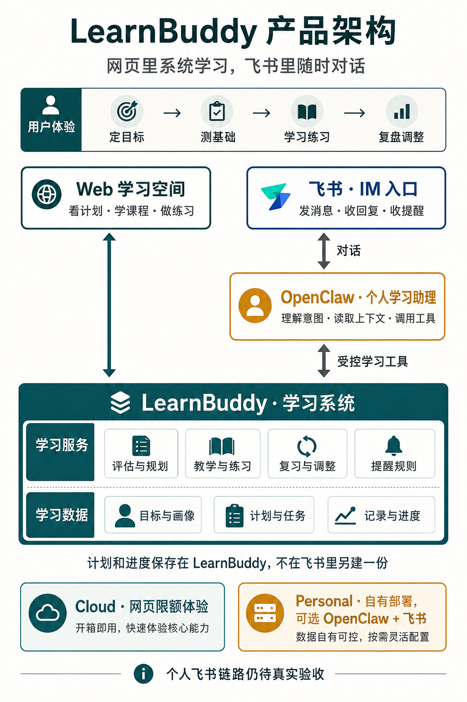
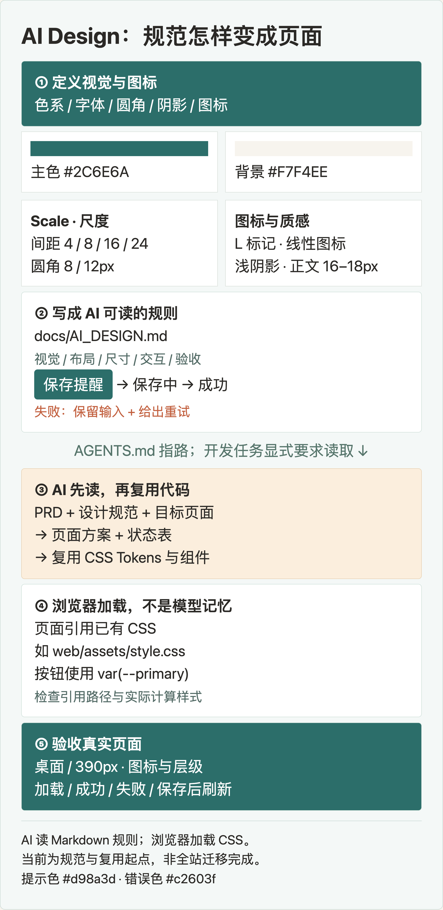
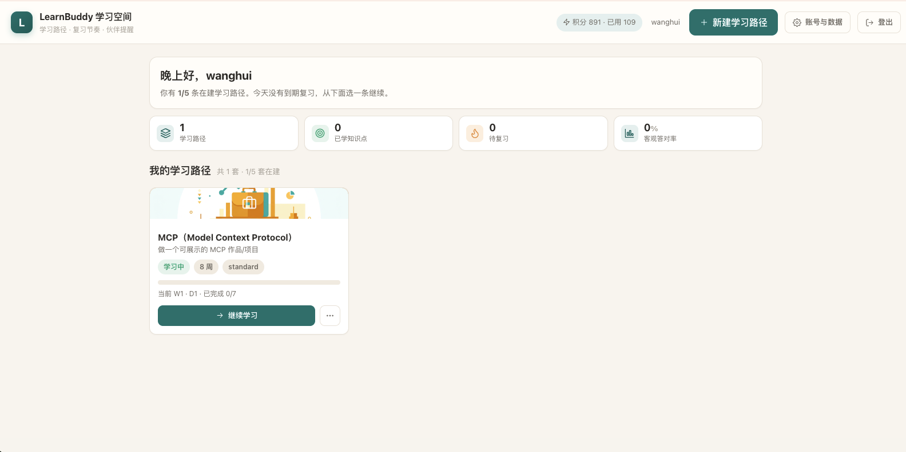
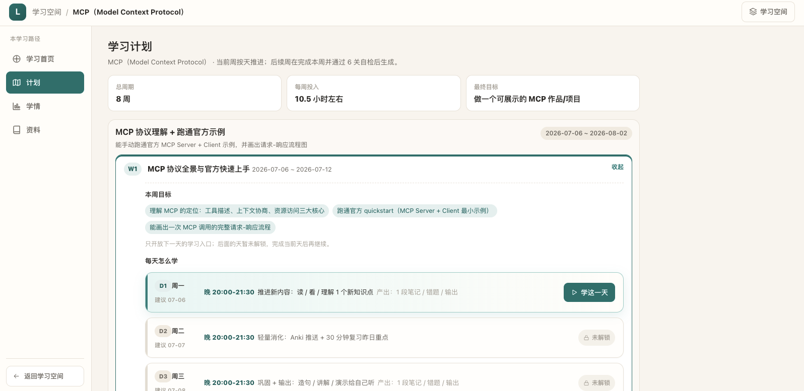
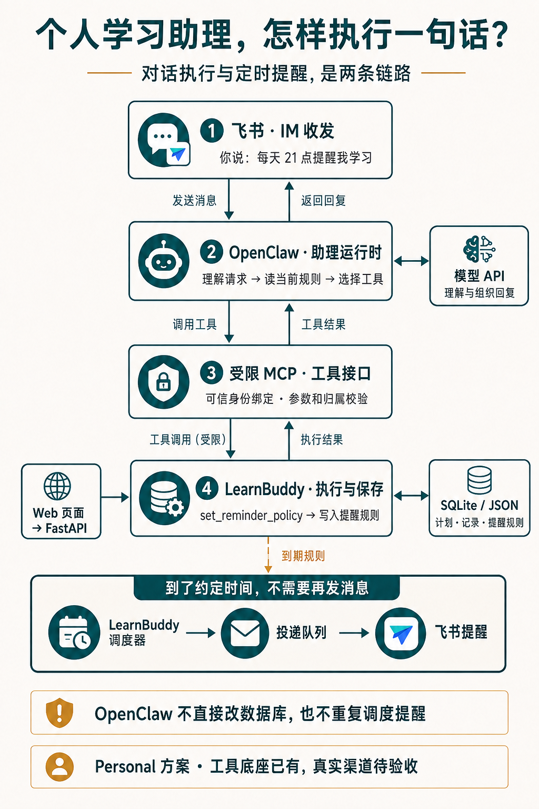
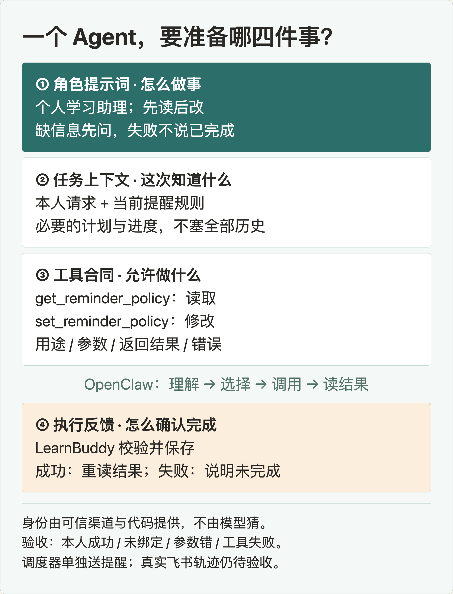
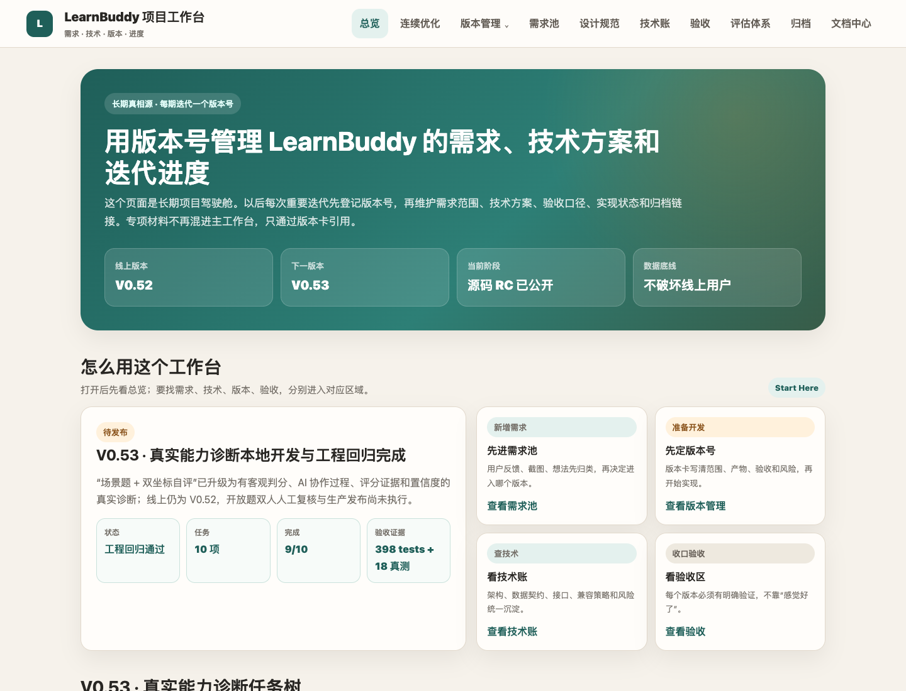

# 用 AI 从零构建学习助手：需求、设计、开发全流程实战

100 天 AI Builder · 第一周｜以 LearnBuddy 为例，拆解一款 AI 产品的构建过程

**LearnBuddy 是一个开源的个人 AI 学习伙伴。** 你告诉它想学什么、现在的基础和每天能投入的时间，它通过对话与摸底，帮你生成学习路径，再把目标拆成每周、每天可以执行的任务。

它面向的不只是编程学习。备考日语、学数据分析、练写作，都可以从一个自然语言目标开始。产品希望解决的，是“知道自己想学什么，却不知道今天怎么学、学到哪里、接下来怎么调整”的问题。

在网页里，你可以看计划、学课程、做练习、查看记录。个人部署后，还可以按接入方案配置 OpenClaw 和飞书：让学习助手出现在日常聊天里，查看学习安排、记录反馈、调整提醒。网页负责完整的学习体验，聊天负责随时沟通。

「100 天 AI Builder」的第一周，我选择把这个项目的代码与构建材料一起开源。这篇文章就沿着它，回答一个实际问题：**不熟悉开发的人，怎样把一个想法交给 AI，逐步做成有页面、有数据、能执行任务的产品？**

这里的 AI Builder，不只是给产品接入一个模型，更是借助 AI 完成需求分析、设计、开发和验证。你负责目标、取舍和验收，AI 帮你拆解任务、生成产物与排查问题。

我们不从技术名词开始，而是跟着一句需求走：“每天晚上 9 点提醒我学习。”

你会看到它怎样变成需求文档、设计规范、前后端代码和 Agent 工具；每一步该给 AI 什么、检查什么，配套文件在哪里。文末还有一个不花模型额度就能运行的验证练习。

## 一、先认识产品：三个角色，不是三个学习系统

想象你正在飞书里问：“今天该学什么？”

**飞书是 IM，也就是即时通讯入口。** 它负责收发消息，让你不必每次都先打开学习网站。你看到的聊天窗口和机器人，是与助手沟通的界面；飞书本身不负责理解学习目标，也不在里面重新维护一套课表。

**OpenClaw 承载个人学习助理。** 它接到消息后，组织对话上下文，让模型理解你的请求，再选择合适的学习工具。例如，先读取今天的计划，再把结果整理成回复。它提供的是“理解请求并安排执行”的能力。

**LearnBuddy 是学习系统。** 学习目标、计划、任务、进度和提醒规则保存在这里。助手通过工具读取或修改这些内容，网页也使用这些内容。因此，无论从网页还是聊天进入，操作的都是同一份个人学习数据。



为什么还需要网页？因为看完整的八周计划、阅读课程和完成练习，页面比聊天更适合。为什么需要助理？因为“今天时间不够，先帮我看看该做什么”这种请求，往往用一句话更自然。

这张图的重点不是组件数量，而是职责：**网页承载学习，飞书承载沟通，OpenClaw 组织行动，LearnBuddy 负责学习能力和记录。**

再往下看，系统需要保存目标、任务和学习反馈，因为后续安排要用到它们。你完成了一项任务，不等于已经掌握这个知识点；所以学习记录与能力判断要分别保留。这些数据细节会在需求文档里展开，不必一开始就背数据库名词。

两种发行方式也很直接：**Cloud 是有限额度的网页体验；Personal 是用户自己部署、持有数据和模型 Key 的个人版。** OpenClaw 与个人飞书属于 Personal 的可选扩展。Cloud 不替每个人托管一套私人助理，不同部署也不会自动共享数据。

## 二、写 PRD：把“我想要”变成 AI 能照着做的要求

PRD 就是产品需求文档。对 AI Builder 来说，它最重要的作用是：让你和 AI 对“做什么、做到哪一步算完成”有同一份依据。

不要只写“支持学习提醒”。这句话没有说明谁被提醒、几点、在哪个时区，也没有说明改时间、暂停和发送失败怎么办。

可以先用下面这张小需求卡。它是基于本项目提醒能力整理的教学示例：

> 使用者：已经绑定自己飞书的个人版用户。<br>
> 任务：每天按上海时间 21:00 收到学习提醒。<br>
> 操作：可以设置、修改或暂停提醒。<br>
> 规则：只能改自己的提醒；同一到期任务不能重复入队。<br>
> 成功：保存后能重新读到规则；到期后能查看投递结果。<br>
> 异常：保存失败保留输入；渠道未配置时不能说“已经送达”。

它把两件容易混淆的事拆开了：**设置成功，是规则保存了；提醒成功，是消息真的送到了。** 如果只验收一个“保存成功”的提示，后半段可能从来没有运行过。

再给 AI 一个明确的工作指令：

> 根据这张需求卡，先列出正常、修改、暂停和失败四种情况。指出需要哪些页面、接口、数据和测试。暂时不要写代码；遇到未定义的规则，先列出来让我确认。

这样你不必提前会写后端，也能检查 AI 有没有漏掉重要情况。它如果只给你一页设置表单，你就知道还缺规则保存、定时执行和送达反馈。

同样的方法也适用于 LearnBuddy 的核心能力：摸底评估。需求不能停在“给出能力分数”，还要规定保存原始回答、能查看评分依据、刷新后继续、其他账号不能访问。**把不能发生的事写清楚，往往比再加十个功能更有用。**

项目的当前 PRD 按“问题、角色、对象、流程、规则、验收”组织；重要取舍放进 SPEC 的决策记录。你不必照抄整套文档，先写透一项用户任务。

当前 PRD（可复制完整地址）：

https://github.com/wanghui2323/learnbuddy/blob/main/docs/01-需求方案.md

SPEC 与决策记录：

https://github.com/wanghui2323/learnbuddy/blob/main/SPEC.md

## 三、AI Design：给 AI 一份能执行的设计说明书

**这里的 AI Design，是给 AI 开发者使用的视觉与交互规范。** 它不是“请设计得高级一点”的风格描述，而是告诉 AI：页面使用哪些数值和组件，图标怎样保持一致，用户操作后怎样反馈。

可以把它拆成三层。

**第一层：设计数值。** 包括色系、字号、间距、尺寸、圆角和阴影。给常用值起一个固定名字，就是 Design Token。例如主色叫 `--primary`，控件圆角叫 `--radius`。Scale 则是一组有秩序的尺度，例如间距按 4、8、12、16、24、32px 选取，避免每个页面随意取值。

**第二层：使用规则。** 同一个主色应该用在主行动上；一个区域只突出一个主按钮。产品标记、图标线条和大小保持一致；正文与辅助信息有层级。加载、保存成功、失败、重试也要有明确规则，不能只设计默认状态。

**第三层：可复用实现。** 把数值写进 CSS，把按钮、卡片和表单的公共样式留下来。后续页面使用它们，不再让 AI 每次从空白处重画一套。



### 在这个项目里，它们分别放在哪里？

`docs/AI_DESIGN.md` 是给 AI 读的说明书，写视觉规则、交互规则和任务模板。

`web/assets/style.css` 是已有的样式实现，包含颜色、间距、圆角、阴影变量，以及按钮、卡片等公共样式。部分页面仍有自己的局部样式，修改前要检查实际引用，不能假设全站已经共用同一套。

`AGENTS.md` 是项目协作入口，要求新改页面先读设计规范。它帮助 AI 找到该读什么，不会自动把规范变成正确的页面。

这三个文件的关系是：**约定从哪里读 → 读懂怎样设计 → 在代码里复用已有样式。**

例如，以下是项目已有变量的一个小例子。看不懂 CSS 也没关系，只需要识别“名字对应一个固定值”：

```css
--primary: #2C6E6A;   /* 主行动 */
--radius: 8px;         /* 控件圆角 */
--space-4: 16px;       /* 间距尺度 */
```

当按钮写 `background: var(--primary)` 时，它使用约定的主色。Token 是样式值，不是模型的输入输出 Token；也不是把文档上传一次，AI 以后就会永久记住。

### 开发时，怎样让 AI 真正用上它？

这里有两种“加载”，一定要分清。

**AI 读取文件**发生在开发时：让 AI 打开需求、设计规范和目标页面，先说明它准备复用哪些变量、组件和状态。**浏览器加载 CSS**发生在页面运行时：页面必须实际引用样式文件，相关类名和变量也要真的用上。只在提示词里写“参考设计规范”，不等于页面已经使用这些样式。

本项目先采用“Markdown 规范 + CSS Tokens + AGENTS.md 入口”的方式，不必一开始就搭一个设计平台。如果以后要把这套流程包装成可复用 Skill，Skill 负责串起读取、实现和检查步骤，仍然要引用这些规则，而不是另写一份容易过时的副本。

你可以直接给 AI 这段任务：

```text
先读取：
docs/AI_DESIGN.md
web/assets/style.css
本次目标页面及它引用的样式文件

为“提醒设置”列出：
主行动、复用 Token、图标与布局、
加载、成功、失败、重试状态。

先说明方案，再修改代码。
给出桌面与 390px 页面截图；
保存后刷新，确认仍是同一条规则。
```

对非技术读者，检查重点是三个：AI 是否真的读了文件？生成的页面有没有使用约定？失败之后用户能不能继续？你不必先审完所有 CSS，也能发现“只画得像，却没有落地”的问题。

AI Design 执行规范与任务模板：

https://github.com/wanghui2323/learnbuddy/blob/main/docs/AI_DESIGN.md

可直接查看的 CSS Tokens 与公共样式：

https://github.com/wanghui2323/learnbuddy/blob/main/web/assets/style.css

视觉与交互规范页面：

https://github.com/wanghui2323/learnbuddy/blob/main/docs/设计规范.html

## 四、前后端怎么分工：页面负责操作，后端负责真实结果

前端是你看到和操作的页面；后端是接收请求、检查规则并保存结果的服务。API 可以先理解成双方约定的交接入口。

继续看“晚上 9 点提醒我”。

前端显示时间、时区和开关。点击保存后，它把这些值发给后端；保存过程中防止重复提交，失败时保留输入。后端先识别是谁，再检查参数和数据归属，最后保存提醒规则并返回结果。

项目已有两个接口：`GET /api/reminders/policy` 用来读取，`PUT /api/reminders/policy` 用来保存。不必记住这些英文；重要的是让 AI 明确“从哪里读、往哪里写、成功和失败分别返回什么”。

前后端不能各自猜数据格式。本项目的提醒参数包含 `local_time`、`timezone` 和 `enabled`。如果页面只传“9 点”，后端却不知道是上午还是晚上、哪个时区，这不是模型聪不聪明的问题，而是交接约定没有写清楚。

你可以这样拆开发任务：

> 先说明接口参数与成功、失败结果，再实现后端保存和读取；随后接上前端。不要用假成功提示代替接口。完成后演示：保存 → 刷新 → 重新读取；再演示一次失败恢复。

这就是一个可检查的小闭环。后端用 Python/FastAPI，前端用原生 HTML、CSS、JavaScript，数据用 SQLite 和路径文件保存。对学习者而言，先理解它们各做什么，比先换一套更复杂的技术栈更重要。

### 真正的产品页面，要看用户能否继续行动

下面是实际登录后的学习空间。它把已有学习路径、当前状态和“继续学习”放在一起，帮助用户回到原来的任务。



进入路径后，长期目标被拆到阶段、周目标和每日安排。截图中的 MCP 学习计划，是一个八周任务。



看这些页面时，不妨先问：我知道下一步点哪里吗？这个按钮点完，数据发生什么变化？刷新后还在吗？

这些问题能把“我觉得不好看”变成具体的改进任务。例如只有一条路径时页面较空，可以调整信息布局；但不能为了填满界面，编造学习记录和掌握度。

后端接口代码：

https://github.com/wanghui2323/learnbuddy/blob/main/server.py

网页源码：

https://github.com/wanghui2323/learnbuddy/tree/main/web

## 五、Agent 怎么开发：让一句话调用真实能力

做 Agent，不是再加一个能说话的框，而是让对话可以安全地调用已有能力。

在这个项目里，个人学习助理由 **OpenClaw 运行时、学习角色提示词、必要的学习上下文、受控工具**一起组成。模型帮助理解和组织回复；工具执行实际操作；LearnBuddy 保存学习结果。



先用一句话把流程走通。下面是应该实现和验收的交互示例，不是已完成的飞书实测记录。

你在飞书说：“每天晚上 9 点提醒我学习。”

第一步，系统通过可信的飞书发送者信息找到对应的个人账号。不能让模型自己填写“我要操作谁”。

第二步，OpenClaw 读取当前提醒规则，结合用户请求确定需要修改的内容。如果时区或指向的学习路径不明确，应先读取已有设置或询问，不要随意猜。

第三步，助理选择工具 `set_reminder_policy`，提交时间和开关等参数。MCP 是连接助理与工具的接口方式；代码负责检查参数、身份和归属，然后保存。

第四步，工具返回真实结果。只有成功了，助理才回复已经保存；失败则说明没有完成，并给出下一步。**模型说了“好的”，不是任务完成的证据。**

### 提示词、上下文和工具，分别怎么准备？

**提示词写行为规则。** 例如：“你是个人学习助理；先读取相关计划和规则；只使用允许的工具；不把建议当成已修改的事实；工具失败时明确说明未完成。”

**上下文提供这次需要的材料。** 问今天学什么，就读今日计划与相关进度；改提醒，就读当前规则。不必每次把全部学习历史塞给模型。

**工具定义允许做什么。** 本项目的工具注册表已有查看今日计划、记录学习事实、读取与修改提醒等入口。每个工具要说清用途、参数、返回值和错误。想增加新能力，先确认后端能完成它，再把它暴露为工具；不能只在提示词里承诺“什么都能改”。



给 AI 开发者的任务可以这样写：

> 先读工具注册表与 OpenClaw 插件。用“调整提醒”检查身份、参数、返回值和失败处理。列出已有能力与缺失能力，不扩大系统权限。分别验证：本人成功、身份未绑定、参数错误、工具执行失败。

这里的身份绑定也不是让用户把密码发给机器人。现有插件使用一次性绑定码，把可信的飞书发送者与 LearnBuddy 账号关联，再获取受限工具访问。具体配置应按个人部署指南操作。

### 自动提醒为什么不是让 Agent 一直聊天？

设好 21:00 以后，不需要用户再发一条消息。LearnBuddy 的调度器检查到期规则，将任务放进投递队列，再发送到飞书并记录结果。OpenClaw 不再重复轮询同一份队列。

也就是说：**对话负责理解和修改需求，调度器负责到点执行，飞书负责把消息送到用户眼前。**

这个分工有两个实际好处：不必持续调用模型来判断“是不是到 9 点了”；也能避免网页和 Agent 各发一遍提醒。当前工具与调度底座已有，真实飞书往返与送达仍需独立验证。

工具定义与实现：

https://github.com/wanghui2323/learnbuddy/blob/main/core/tools.py

OpenClaw 插件：

https://github.com/wanghui2323/learnbuddy/blob/main/integrations/openclaw-learnbuddy/index.js

个人部署与接入指南：

https://github.com/wanghui2323/learnbuddy/blob/main/docs/PERSONAL_DEPLOYMENT.md

## 六、开发工作流：把一次任务交接完整

AI Builder 的价值，不只是让 AI 多写几段代码，而是学会给它正确的上下文、明确的任务和可检查的结果。你可以让 AI 提出方案、比较取舍、实现并自检，但最终仍要依据证据作判断。

本项目把协作规范放进 `AGENTS.md`：先读现状，再写计划，然后实现、验证，最后提交。你可以把一次任务的交接材料缩到四项：

- **需求**：这次改变什么，不改变什么。
- **依据**：PRD、AI Design、相关代码与接口。
- **范围**：允许改哪些文件，哪些能力不能自行扩展。
- **证据**：用什么操作或测试证明成功，也证明失败能处理。

因此，同一个小需求可以这样推进：让 AI 找出遗漏规则 → 你确认范围 → AI 读取设计规范并提出页面方案 → 你确认主行动 → AI 实现并运行测试 → 你复查真实结果。发现错误时，把具体证据反馈给 AI，而不是只说“再优化一下”。

开发工作台把这些材料连接起来：版本里有哪些需求，任务先后依赖什么，代码和测试在哪里，哪些项还没通过。



比如“提醒功能”不能只挂一个“完成”标签。规则保存、定时检查、消息投递、失败重试分别有自己的结果。页面完成了，就记页面完成；消息还没收到，就保留那一项继续查。

工作台目前是人工维护的静态页面。它的价值是让你和 AI 下一次回来时知道从哪里继续，不是制造一个漂亮的完成率。

### 跟着做：验证一次“不会重复提醒”

克隆仓库、按 README 安装依赖并激活环境后，运行这个已有测试：

```bash
python -m pytest tests/test_agent_integration.py \
  -k due_reminder_is_idempotent -q
```

这个名字里的 idempotent，可以理解为“同一操作重复执行，不应额外产生一份结果”。用例创建临时账号和规则，在同一时刻重复检查到期提醒，第一次应入队一条，第二次应入队零条。

它不调用真实模型，也不向飞书发送消息。你能验证的是“重复检查不会重复入队”，不是“任何网络故障下都绝不重复送达”。这两件事要分开测。

运行之前写预测，运行之后看结果。如果失败，把报错交给 AI，让它定位原因，不要让它直接删掉断言。暂时不写代码，也可以阅读用例，再为自己的产品写一个同样具体的反例。

最后用四行记录：**我改了什么、怎么验证、实际结果、下一步做什么。** 这就是下一轮迭代最小、可复查的起点。

开发协作规范：

https://github.com/wanghui2323/learnbuddy/blob/main/AGENTS.md

完整开发工作台：

https://github.com/wanghui2323/learnbuddy/blob/main/docs/LearnBuddy项目工作台.html

本节练习的测试文件：

https://github.com/wanghui2323/learnbuddy/blob/main/tests/test_agent_integration.py

## 七、第一周交付：先让一套构建框架可以被复用

这次开源包含源码，也包含产品架构、PRD、AI Design、前后端与 Agent 接入材料、真实页面、开发工作台和测试。你可以拿走其中一份模板，也可以选择一个小需求，沿着整条路径跟做。

仓库入口：

https://github.com/wanghui2323/learnbuddy

分类交付目录（产品、设计、页面、架构、开发与验证）：

https://github.com/wanghui2323/learnbuddy/blob/main/docs/README.md

GitHub 上的 HTML 文件默认显示源码。克隆后如何预览，分类目录里有说明；文章里的完整地址也可以直接复制到浏览器。

**目前交付的是第一版开源功能与构建框架。** 公开源码为候选版；个人飞书实测、干净环境安装和新版线上回归等后续工作，继续在工作台跟踪。

接下来会围绕四条线迭代：完善 AI Design 的界面风格与交互一致性；改进提示词、上下文和 Agent 工具，并用评估验证效果；逐步升级系统架构与稳定性；补齐真实使用中的功能缺口。

我们会把这些取舍、修改和验证继续公开。你不仅能看到 LearnBuddy 最后长什么样，也能跟着理解：**一个 AI 产品，是怎样一项需求、一份规范、一次验证地构建出来的。**
