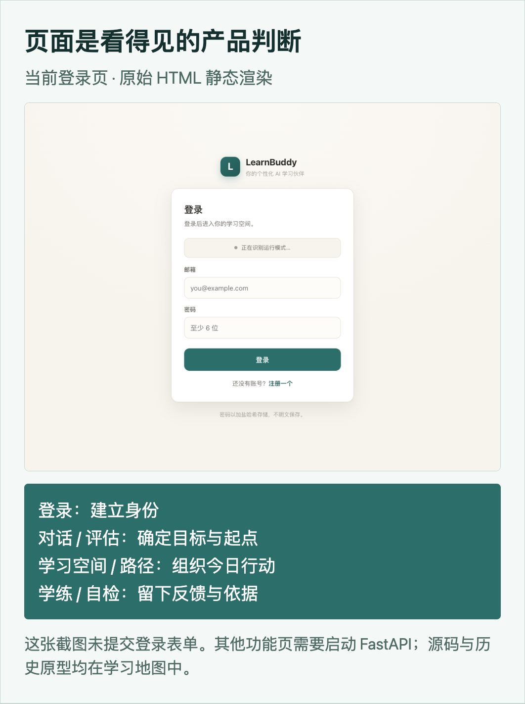
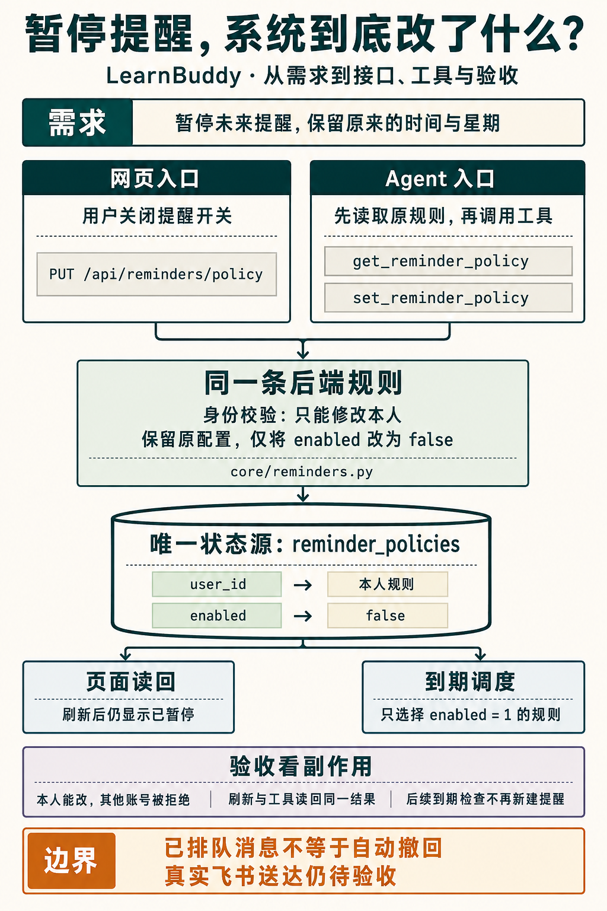
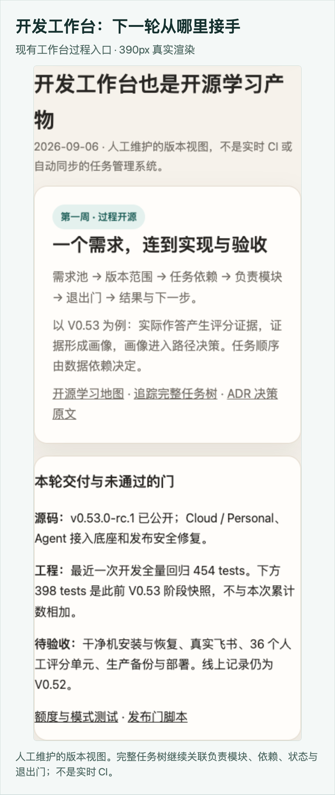

# AI Builder 第一周：把 LearnBuddy 的构建过程一起开源

一个 AI 项目能运行了，我们能从它学到怎样做产品吗？

打开代码仓库，你可能仍然不知道：为什么做这些功能？页面为何这样安排？Agent 能改什么？一次需求怎样走到可验收的版本？

这是 100 天 AI Builder 第一周想回答的问题。我把 LearnBuddy 开源，也把产品判断、设计规范、页面、代码和开发工作台整理成了[一张学习地图](https://github.com/wanghui2323/learnbuddy/blob/main/docs/README.md)。

文章讲因果，仓库留产物，工作台记录下一轮从哪里接手。

## 1. 产品：用户需要的，不只是一份学习计划

以“三个月准备日语 N3，每天半小时”为例。让模型生成十二周计划并不难，难的是接下来：起点判断错了怎么办？今天只有十五分钟学什么？上周的内容忘了，计划要不要调整？

所以 LearnBuddy 的核心不是一份文本，而是一条持续变化的学习路径：

**说清目标 → 实际摸底 → 生成路径 → 每日学练 → 用反馈调整。**

这条链至少涉及四类对象：目标与时间约束、评估及评分证据、路径与每日任务、学习记录与掌握度。后一步消费前一步的结果；缺少反馈，所谓个性化就停留在第一次生成。

摸底不能只问“你觉得自己是什么水平”。实际作答才提供能力依据；独立完成与借助 AI 完成也应分开，否则容易把“有人帮忙能做”当成“自己已经掌握”。

这个产品判断决定了后续实现：要保存答案与评分依据，要给用户明确的下一步，也不能让 Agent 另存一份互不一致的计划。

[需求方案与决策记录](https://github.com/wanghui2323/learnbuddy/blob/main/SPEC.md)保留了这些选择。日语只是解释场景；LearnBuddy 面向可以用自然语言描述的不同学习需求。

## 2. 需求：一句定位，要变成可检查的规则

本周的重要调整，是把“方便体验”和“长期拥有”分开。

Cloud 用平台模型提供有限额度体验；Personal 让个人自己部署、自备模型密钥，并按需连接自己的 OpenClaw 和飞书。

这不只是加一个模式按钮。Personal 只有一位使用者，就要检查第二账号能否注册；Cloud 有额度限制，就要保证后端在调用模型前拒绝超额请求。

你可以在[双版本方案](https://github.com/wanghui2323/learnbuddy/blob/main/docs/07-开源与公有云双版本架构.md)看取舍，再去测试中检查反例。

写需求时，我会追问四件事：**谁遇到什么问题？完成后什么状态改变？这次不做什么？正常与失败情况怎样验收？**

例如“平台额度用尽后不再产生模型费用”，验收不能只看页面提示：后端应返回 429，测试还要断言模型函数没有被调用。这样需求才真正约束实现。

## 3. 设计：先决定用户怎样行动，再决定怎样好看

学习空间首屏应该呈现“今天做什么”，还是堆满统计数字？生成中断后，用户能否理解原因并继续？评估尚未完成，页面能不能显示确定的能力结论？

这些问题先决定信息顺序和交互状态，再落实到颜色、间距和组件。

LearnBuddy 的[设计规范](https://github.com/wanghui2323/learnbuddy/blob/main/docs/设计规范.html)包括产品原则、信息架构、Design Tokens、组件与验收。Design Tokens 可以理解为“有名字、可复用的设计决定”：主行动色、错误色、间距和圆角，都不必每页重新发明。

但规范不等于实现。当前对话页用 `--teal: #2c6e6a` 表达主行动、`--red: #c2603f` 表达错误；颜色应与按钮、禁用、加载、失败等组件状态配套。页面间仍有重复定义，尚未完成全站统一。这个差距也公开，读者可以对照 CSS 研究怎样改进。

学习地图还连接了目标对话、学习空间、路径与学练、自检页的源码，并保留历史可交互原型。真实页面、历史原型与解释图分开标注，方便看清产品怎样演进。

## 4. 前后端与 Agent：最后改的必须是同一份状态

用户提交一次评估，前端通过 `/api/baseline/assessments` 创建评估，得到 `assessment_id`；逐题回答关联同一 ID，后端保存答案与评分证据。刷新后恢复同一次评估，生成器再消费完成后的画像。

当前架构是原生 HTML/CSS/JS → FastAPI → 学习领域模块 → SQLite 与 JSON 路径文件；模型 API 按需调用。身份、额度、持久化由服务端负责，不能交给模型自行遵守。

因此，页面“看起来成功”还不够，数据必须真的保存，身份不能串用，失败需要能恢复。[学习地图中的架构与源码入口](https://github.com/wanghui2323/learnbuddy/blob/main/docs/README.md)可以沿着一次请求读下去。

Agent 也遵守这个原则。你在飞书说“暂停学习提醒”，机器人不能只回复“好的”。它需要识别本人、读取规则、调用受限工具保存，再根据工具结果回复。

**LearnBuddy 保存学习事实；OpenClaw 负责个人渠道与对话；工具连接两者。**

具体到暂停提醒：先用 `get_reminder_policy` 读取原规则，再用 `set_reminder_policy` 保留时间、星期等配置，将 `enabled` 改为 `false`。网页接口与工具最终调用同一后端规则，写入 `reminder_policies`。注意：接口不是局部更新；漏传时间等字段会使用默认值，因此调用方必须带回原配置。

[工具契约](https://github.com/wanghui2323/learnbuddy/blob/main/core/tools.py)公开了能调用什么、需要哪些参数。MCP 提供工具调用接口；提醒仍由 LearnBuddy 的调度器读取同一份规则，避免两边各管一套时间。

这里还要区分“暂停未来调度”与“撤回已经排队的消息”，前者不能自动证明后者。真实飞书往返和定时送达仍待验收。

## 5. 开发工作台：让别人能够接着做

产物越来越多之后，怎样判断哪些是当前方案，哪些属于旧版本？谁依赖谁？完成到哪里，下一步又是什么？

[开发工作台](https://github.com/wanghui2323/learnbuddy/blob/main/docs/LearnBuddy项目工作台.html)负责把这些关系连起来。它面向维护者，与学习者使用的“学习空间”不同。

以 V0.53 的能力诊断为例：先保存答案，再产生评分证据，然后呈现画像，最后让路径生成消费画像。任务顺序来自数据依赖，不是随意排期。

例如 V053-03 负责判分证据，V053-06 负责结果呈现，V053-07 让路径消费画像，V053-10 才是完整验收与发布。工作台关联负责模块、依赖、状态与退出门；ADR 记录为什么这样决定。它目前是人工维护的静态版本视图，不是实时同步的项目管理平台。

这次也整理了旧文档：历史架构明确标注，当前入口更新，设计目标与实现状态分开。过程开源的前提，是读者不会把旧方案误当成现在的事实。

## 第一周，交付到哪里？

LearnBuddy 已有此前的学习系统积累，不是这一周从零完成。本周交付的是双版本调整、个人 Agent 底座、安全修复，以及可追溯的开源学习入口。

源码已按 MIT 协议公开，版本为 v0.53.0-rc.1。此前最近一次累计工程回归是 454 条测试通过；这不代表真实用户任务全部验收。

干净机安装与恢复、真实飞书、开放题双人人工评分和新版生产部署仍需完成。线上记录仍为 V0.52。

如果你也跟着练习，可以只选一个小需求，例如修改提醒时间：先写预测，再追到页面、API、数据与测试，运行后比较结果，把差异记进版本卡。

**看文章理解原因，看产物研究方案，看源码动手修改，再用验证决定下一步。** 这就是我们希望一起走下去的 AI Builder 学习路径。
