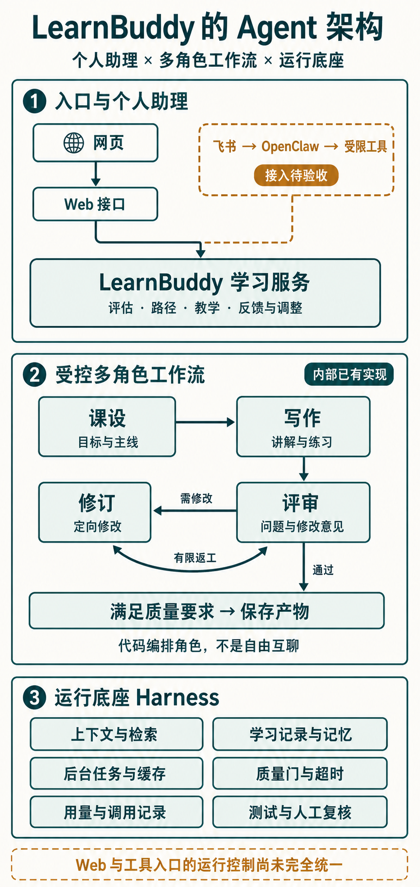

# 用 AI 从零构建学习助手：需求、设计、开发全流程实战

100 天 AI Builder · 第一周

有一个产品想法，却不知道怎样把它做出来，这是很多人使用 AI 开发时的第一道坎。

让 AI 生成页面不难。难的是：该有哪些功能？数据怎么保存？智能体怎样参与？做完以后，又凭什么判断它真的能用？

**100 天 AI Builder 的第一周，我们用 LearnBuddy 做了一次产品构建实践，并把源码、需求、设计规范和开发工作台一起开源。**

LearnBuddy 是一个个人 AI 学习伙伴。你告诉它想学什么、目前的基础和可投入的时间，它通过对话与摸底形成学习路径，再把目标拆成可以执行的任务。学习记录与评估结果，为后续复习和调整提供依据。它面向日语、编程、写作等不同领域，不只服务技术学习。

这篇文章分享的，是怎样借助 AI 把这些能力组织成一个产品。你可以复刻 LearnBuddy，也可以把同样的方法用到自己的项目上。

**先看完整框架：产品定位 → 需求文档 → AI Design → 系统与 Agent 架构 → 分步开发 → 验收交付。** 每一步留下明确产物，作为下一步交给 AI 的输入。

项目源码与启动说明：
https://github.com/wanghui2323/learnbuddy

## 一、先确定：我们到底在做什么产品？

如果只告诉 AI“做一个学习助手”，它很容易交出聊天框、课程卡片和进度条。页面齐了，学习过程却不一定成立。

LearnBuddy 从自学者的三个问题出发：**从哪里开始，今天做什么，学完以后怎样继续。**

因此，产品需要连起一条完整过程：

**描述目标 → 摸清基础 → 生成路径 → 学习与练习 → 记录效果 → 复习与调整。**

摸底是为了避免只凭一句“我是初学者”就安排课程。学习记录也不只是打卡次数，而是让下一次推荐知道用户做过什么、哪里需要补强。完成任务和掌握能力是两件事，不能用同一个百分比代替。


围绕这条学习主线，三个角色各有职责：

**LearnBuddy 是学习系统。** 管理目标、评估、路径、任务和记录，提供学习、复习与调整能力。

**OpenClaw 是个人助理的承载层。** 在个人部署的接入方案中，它组织对话、调用工具，帮助用户使用学习系统，不另建一份私人课表。

**飞书是聊天入口。** 用户在这里提问、提交反馈、接收消息。网页适合完整阅读和练习，聊天适合随时问一句、记一笔，两者使用同一套学习数据。

使用方式也分开：Cloud 提供有限模型额度的网页体验；Personal 由个人部署、自备模型 Key、保有数据，可选配置自己的 OpenClaw 和飞书应用。它们共享代码，不自动共享私人数据，也不由平台替每个人长期托管一套助理。

**用 AI 构建产品的第一步，是先确定用户要完成什么，再决定需要哪些能力和入口。**

## 二、用 AI 整理需求：把想法变成产品框架

PRD，就是产品需求文档。对 AI 开发来说，它是持续回答“做什么、为什么做、怎样算完成”的依据，而不只是写完存档的说明。

LearnBuddy 的需求可以按五层组织。

**第一层：用户与问题。** 谁使用？在哪个阶段遇到困难？这里的核心是自学者缺少适合自己的安排与反馈，不是“缺一个机器人”。

**第二层：完整旅程。** 从首次描述目标，到重新打开产品继续学习，写清用户的行动与得到的结果。否则 AI 容易只实现第一次生成，忽略长期使用。

**第三层：能力模块。** 将旅程拆成对话、评估、路径、学练、学情、复习与调整。还要说明模块怎样交接：评估产生的能力画像如何影响路径，练习反馈如何进入下一次安排。

**第四层：数据与规则。** 系统要记住目标、答案、评分依据、任务和学习记录。规则约束这些数据：只能访问本人内容；未完成判分不能宣称掌握；生成失败应允许恢复，不能把空结果当成成功。

**第五层：版本与验收。** 哪些本次交付，哪些后续再做？用户走到什么结果才算完成？页面呈现、数据保存、真实渠道连通，应分别验收。

框架确定后，再让 AI 补全和拆解：

> 根据产品定位与现有代码，梳理完整用户旅程、能力模块、核心数据、业务规则和版本范围。先检查缺漏与冲突，不写代码。对每个模块说明输入、用户操作、输出、依赖及验收方式，区分已有能力和本次新增。

AI 帮你发现遗漏，你负责范围与取舍。例如，优先增加更多课程，还是先让当前路径真正可执行，不能只由模型决定。

**这一阶段的产物，是一份可追踪的 PRD：每项需求能找到对应页面、服务和验收条件。** 后面的设计与开发从这里出发，不各自重新猜一次产品。

## 三、AI Design：把界面规则变成 AI 能使用的材料

需求说明产品做什么，AI Design 说明这些能力怎样呈现、怎样交互。

**AI Design 是给 AI 开发者使用的视觉与交互规范。** 不能只有“简洁、好看”，还要落实为配色、字体、圆角、阴影、间距、尺寸、布局、图标，以及加载、空白、失败和恢复状态。

LearnBuddy 用三种文件配合：

- `docs/AI_DESIGN.md`：解释设计规则、页面要求与验收方式。
- `web/assets/style.css`：保存可复用的设计值和公共样式。
- `AGENTS.md`：要求 AI 修改页面前读取相关规范。


Design Token 是有名字的设计值，例如主色 `--primary`、圆角 `--radius`；Scale 是一组允许使用的尺度，例如间距采用 4、8、12、16、24px 等已有档位。这能减少 AI 在不同页面上随意发挥。

交互规范同样重要：生成路径时说明正在进行什么；失败后保留输入；保存成功依据后端结果。否则视觉统一了，体验仍然可能断裂。

开发时要分清两种“加载”：**AI 在开发前读取规范，浏览器在运行时加载 CSS。** AI 看过文档，不代表页面已经引用样式，更不代表所有按钮都遵守规则。

页面任务可以这样交给 AI：

> 先读当前 PRD、AI Design 和目标页面。说明页面服务哪一步学习任务、主行动是什么、复用哪些样式，并列出加载、空态、成功、失败和恢复状态。确认后实现，再检查桌面与手机端。

先交页面方案，再写代码，最后用截图和实际操作核对。以后可以用 Skill 串起步骤，但 Skill 不能替代设计规范本身。

当前规范是后续开发的共同依据，不代表历史页面已全部统一。个人项目先建立能被使用的规则，比一开始建设庞大的设计系统更实际。

## 四、前后端架构：让每项需求都有落点

接下来，要把产品能力分配到系统中。LearnBuddy 当前采用原生 HTML/CSS/JavaScript、Python/FastAPI，以及 SQLite 和学习路径文件。

不必一次记住技术名字，先理解四层分工：

| 层次 | 在产品里负责什么 |
|---|---|
| 前端页面 | 承接对话、评估、计划、学习和学情，让用户操作、看到结果 |
| 接口层 | 接收请求，校验身份、参数与额度，把结果返回页面 |
| 学习服务 | 处理评估、路径生成、课程、练习、复习和重规划 |
| 数据层 | 保存账号、评估依据、路径、任务和记录，支持下次继续 |

前端主要在 `web/`，接口入口在 `server.py`，学习能力位于 `core/`。**接口是前后端对“交什么、返回什么”的约定；数据让一次操作变成可以持续使用的产品状态。**

沿着学习过程看：目标和回答进入评估服务，评估结果成为路径生成的输入；路径进入计划页，任务进入学练页；练习和反馈保存后，再供学情、复习与调整使用。

所以，开发不能只是“先画几个页面，再补接口”。要先确认模块之间传递什么，以及谁负责保存。


学习空间解决“回到哪里继续”；计划页则把长期目标连接到阶段、周目标与每日任务。真实截图用来对照需求与架构，不只是展示页面好看。


让 AI 落地时，先要求一份对应表：**需求模块 → 页面 → 接口 → 学习服务 → 保存的数据 → 测试入口。** 已有代码先标出复用位置，不默认重做。

随后按依赖开发：先跑通“描述目标—评估—生成路径”，再连接“进入任务—练习—记录”，最后补齐“复习—反馈—调整”。每条链路同时包含界面和后端，不把“页面做完”当作产品完成。

换成健身、阅读或求职助手，业务模块会变，但页面、服务与数据之间的对应关系仍然需要明确。

## 五、Agent 怎么构建：个人助理、多角色工作流与运行底座

学习助手既要听懂用户，也要产出合适的学习内容，还要控制质量与失败风险。把这些都交给一句“你是一位优秀老师”，很难稳定落地。

LearnBuddy 将它们分成三层：**个人助理负责调用能力，专业工作流负责完成任务，运行底座负责约束与记录。**

早期方案讨论过研究、课程设计、写作、评审等多 Agent 分工。实际落地时，先采用代码编排的多角色工作流，而不是让多个自主 Agent 自由讨论。两者不能混称为“多 Agent 已全部上线”。



### 第一层：个人助理，连接用户与学习能力

在个人部署的接入方案中，飞书负责收发消息，OpenClaw 承载助理：根据当前请求读取相关计划与记录，再选择工具。网页则直接通过 Web 接口使用学习服务，不需要经过 OpenClaw 才能学习。

助理不是凭聊天记忆另排一份课表。它通过 `core/tools.py` 中的计划查询、课程生成、回答记录、资料检索等工具操作 LearnBuddy。MCP 是其中的工具连接方式，身份与数据归属仍由代码控制。

这一层需要交付的是：角色提示词、上下文读取规则、工具定义与权限检查。没有对应工具的动作只能建议，不能宣称已执行；修改失败也不能回复“已经完成”。

### 第二层：多角色工作流，把内容真正做好

内部最能说明构建方法的，是课程生成。它的关键不是多起几个聊天窗口，而是给每个角色一份明确的任务合同。

**课设角色先决定教什么。** 读取学习目标、基础摘要和相关材料，输出本节核心问题、预期成果、主线与边界。

**写作角色按课设展开。** 接收已确定的结构，再生成讲解、例子和练习，不在写作时重新选择教学方向。

**评审角色寻找具体问题。** 对照内容检查具体性、深度与依据，交付问题清单和修改意见，不只给一句“质量不错”。

**修订角色定向修改。** 接收草稿与评审意见，修改后重新检查；质量退步时不直接覆盖原稿，达到次数上限则停止。

这些不是只写在方案里的角色名。在 `core/content.py` 中，它们分别对应 `design_lesson`、`write_lesson`、`critic_lesson`、`revise_lesson`；提示词独立保存在 `core/prompts/lesson_*.md`，质量循环由 `_run_lesson_quality_loop` 编排。

**角色可以共用模型与运行环境，不需要为每个角色部署一套系统。** 本项目通过不同提示词、结构化产物和函数调用形成分工。代价是一次课程可能需要多次模型调用，因此返工必须有边界。

### 第三层：Harness，让协作过程可控

Harness 可以理解为 AI 的运行支撑：不是另一个“主管 Agent”，而是包在模型与工作流周围的工程机制。

**给它合适的依据。** 记忆、学习记录与检索材料按任务组织。当前并非所有课程节点都已完整消费新版能力画像，这仍是待补齐的连接。

**让任务状态可见。** 后台任务、进度与缓存支撑长时间生成，用户能查询状态。状态能恢复查询，不等于进程重启后能从任意步骤断点续跑。

**限制错误与成本。** 程序质量门检查结构等硬问题，模型评审检查内容问题；修订上限、超时和降级控制资源消耗。循环保留相对更好的候选，也不等于内容已经获得教学效果认证。

**留下验证材料。** 用量、调用记录和质量记录帮助排查，测试检查分支行为。当前记录还缺统一的运行标识，Web 与工具入口的额度、后台任务和质量控制也尚未完全统一。

因此，图中展示的是已有支撑能力与接入边界，不是所有入口都已享有同等保障。真实 OpenClaw／飞书往返仍待验收。

### 怎样借助 AI 复刻这套构建方式？

先拆职责，再确定每个角色的输入、输出和失败处理；用代码组织交接、返工与停止；最后用测试和真实样本检查结果，而不是先追求 Agent 数量。

你可以把这段任务交给 AI：

> 阅读课程生成代码与角色提示词，整理各节点的输入输出合同。标出谁组织上下文、谁决定返工、在哪里保存结果，以及停止条件。先检查现有实现，再提出修改方案。为正常通过、评审失败、修订退步和达到上限补充验证，不扩展无关权限。

仓库中的 `tests/test_content_review.py` 已有正常生成、评审后修订、模型切换和修订上限等用例。它们用模拟模型输出检查编排，不证明真实课程一定优质；内容效果仍需要跨领域样本和人工复核。

**好的 Agent 架构，不是把所有能力都改名为 Agent，而是让每项职责有明确输入、可检查的产物和可控的退出方式。**

## 六、怎样用 AI 把整个项目一步步做出来？

前面不是各写一份文档就结束，而是形成一条开发链：

**PRD 确定范围，AI Design 约束体验，架构划分职责，任务计划安排顺序，测试与操作记录证明结果。**

为避免每次换对话都重新解释，可以把稳定规则放入 `AGENTS.md`，重大取舍写入 `SPEC.md`，当前任务与证据连接到开发工作台。


工作台不是给学习者使用的页面，而是 Builder 自己的项目导航。目前它是人工维护的静态页面，帮助回答：这次做什么、依赖什么、做到哪里、还缺哪项验证。

如果准备复刻，可以分三步。

**先理解并运行。** 按 README 启动项目，选自己的学习目标，走过对话、评估、路径和任务入口。先解决环境与模型配置问题，不急着改代码。

**再对照并修改。** 将模块与 PRD、页面和服务对应起来，确认怎样工作，再加入自己的需求。先有完整产品地图，再选择一条完整用户路径实施，不一次要求 AI“做完全部”。

**最后验证并交付。** 检查正常结果，也检查刷新恢复、参数错误、权限隔离和模型失败。保留测试或实际操作证据，明确哪些尚未验证。

一份可复用的 AI 开发任务，可以这样写：

```text
产品目标：……
本轮要完成的用户路径：……

先读取当前 PRD、AI Design、架构与相关代码。
列出已有能力、缺口、依赖和不修改的范围。
把任务拆成可验收的小步，说明先后顺序。
方案确认后再实施。

交付代码、测试和真实操作证据。
分别说明：已完成、已验证、仍有风险。
```

关键不是提示词多长，而是 AI 有可靠输入，你有明确检查方法。

截图不能证明数据保存，测试通过不能证明飞书连通，本地运行也不能证明线上发布成功。每一步只对自己的证据负责，下一轮才知道从哪里继续。

## 七、第一周交付了什么，你可以从哪里开始？

这次开源交付包括学习产品源码，以及围绕它整理的需求、AI Design、架构说明、协作规则和开发工作台。它们构成一个可以阅读、运行、修改和验证的项目起点。

资料集中如下。先读需求与设计，再看架构和代码；详细源码、插件与测试入口由分类目录承接。

**产品需求｜PRD 当前合同**  
https://github.com/wanghui2323/learnbuddy/blob/main/docs/01-需求方案.md

**视觉与交互｜AI Design 执行规范及任务模板**  
https://github.com/wanghui2323/learnbuddy/blob/main/docs/AI_DESIGN.md

**系统与个人助理｜Cloud / Personal 架构**  
https://github.com/wanghui2323/learnbuddy/blob/main/docs/07-开源与公有云双版本架构.md

**Agent 与运行支撑｜Harness 实现盘点及代码映射**  
https://github.com/wanghui2323/learnbuddy/blob/main/docs/05-Harness技术体系对齐.md

**AI 开发协作｜项目规则**  
https://github.com/wanghui2323/learnbuddy/blob/main/AGENTS.md

**任务与验收｜开发工作台**  
https://github.com/wanghui2323/learnbuddy/blob/main/docs/LearnBuddy项目工作台.html

**完整资料索引｜页面、源码、插件、部署与测试入口**  
https://github.com/wanghui2323/learnbuddy/blob/main/docs/README.md

地址均可直接复制。GitHub 中的 HTML 默认可能显示源码，本地预览方式见资料索引。历史方案不等于现行要求，阅读时以当前合同和最新决策为准。

**目前发布的是第一版开源功能与构建框架，源码仍为候选版，不代表新版已经生产上线。** 后续会完善视觉与交互一致性、提示词和 Agent 效果评估、系统稳定性与功能完整性。安装恢复、真实渠道与新版上线等验证事项，在工作台继续跟踪。

如果你也想开始，不必先掌握所有技术。先写清自己的用户、问题和完整任务，再用这套框架组织材料，让 AI 帮你分析和实现。

**AI Builder 的核心，不只是会用 AI，而是能用 AI 把想法推进成产品，并对结果作出判断。**
